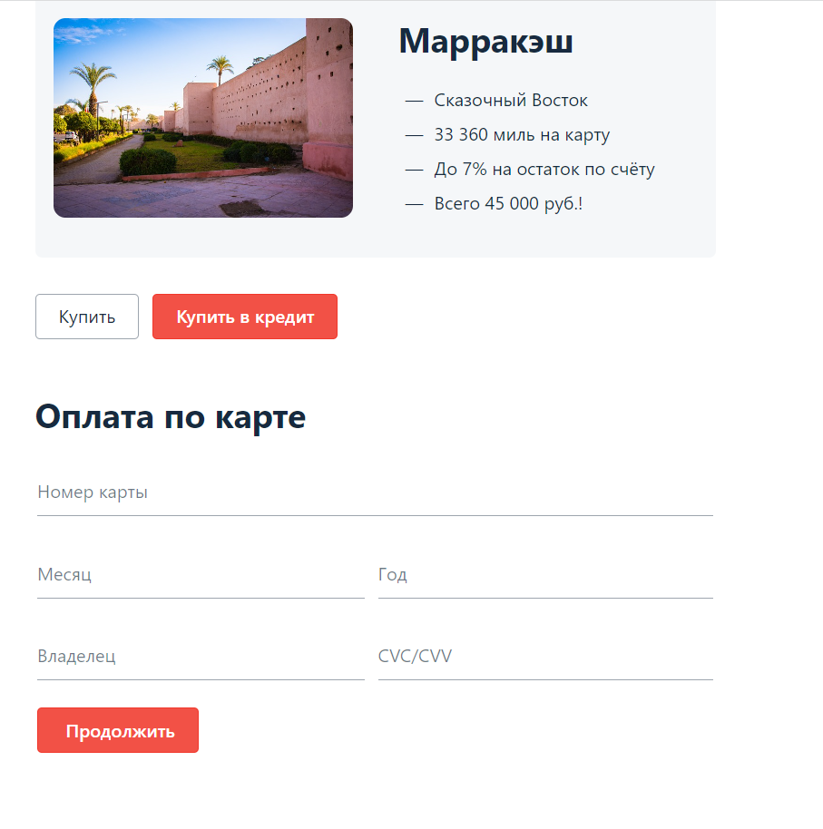

# План внедрения автоматизации

## 1. Перечень автоматизируемых сценариев.

## **1.1 Автоматизация тестирования кнопок "Купить" и "Купить в кредит"**

**Предусловия:** Открыта страница приложения [http://localhost:8080/](http://localhost:8080/)

* ## *Вывод формы для ввода данных карты на экран после нажатия кнопки "Купить"**

1. Нажать кнопку "Купить"

 Ожидаемый результат: на экран выводится форма для ввода данных карты

* ## *Вывод формы для ввода данных карты на экран после нажатия кнопки "Купить в кредит"**

1. Нажать кнопку "Купить в кредит"

 Ожидаемый результат: на экран выводится форма для ввода данных карты

## **1.2 Автоматизация тестирования формы, которая выходит при нажатии кнопки "Купить"**

**Предусловия:** Открыта страница приложения [http://localhost:8080/](http://localhost:8080/), нажата кнопка "Купить" или "Купить в кредит", на экран выведена форма для оплаты картой.

**Валидные данные:**

 * Поле "Номер карты"

 Допустимы: значения 1111 2222 3333 4444, 5555 6666 7777 8888 

 * Поле "Месяц"

 Допустимы: число из двух арабских цифр,значения от 01 до 12 (если год стоит текущий, то не меньше текущего месяца)

 * Поле "Год"

 Допустимы: число из двух арабских цифр (две последние цифры года), не меньше текущео года

 * Поле "Владелец"

 Допустимы: латинница, пробелы (не первый и не последний), дефис (не первый и не последний), точка (не первая и не последняя), не больше 20 символов, не меньше 2х символов (E. FIRST-SECOND)

 * Поле "CVC/CVV"

 Допустимы: три арабские цифры
 

* ## **Отправка формы заполненной валидными данными, карта 1111 2222 3333 4444**

 1. Заполнить поле "Номер карты" значением 1111 2222 3333 4444.

 2. Заполнить остальные поля валидными данными.

 3. Нажимаем кнопку "Продолжить".

 Ожидаемый результат: форма отправлена, всплывает окно с сообщение "Успешно".

* ## **Отправка формы заполненной валидными данными, карта 5555 6666 7777 8888**

 1. Заполнить поле "Номер карты" значением 5555 6666 7777 8888.

 2. Заполнить остальные поля валидными данными.

 3. Нажимаем кнопку "Продолжить".

 Ожидаемый результат: форма отправлена, всплывает окно с сообщение "Ошибка".

* ## **Отправка формы с невалидным номером карты (все 0)**

 1. Заполнить поле "Номер карты" значением 0000 0000 0000 0000.

 2. Заполнить остальные поля валидными данными.

 3. Нажимаем кнопку "Продолжить".

 Ожидаемый результат: форма не отправлена, всплывает окно с сообщение "Ошибка", сообщение под полем "Номер карты".

* ## **Отправка формы с невалидным номером карты (любой другой номер карты не из 2х предложенных и не из 0)**

 1. Заполнить поле "Номер карты" значением 1111 1111 1111 1111.

 2. Заполнить остальные поля валидными данными.

 3. Нажимаем кнопку "Продолжить".

 Ожидаемый результат: форма отправлена, всплывает окно с сообщение "Ошибка".

* ## **Отправка пустой формы**

 1. Оставить все поля формы пустыми

 2. Нажать кнопку "Продолжить"

 Ожидаемый результат: Сообщение об ошибке под каждым полем ("Неверный формат" под всеми полями, кроме поля "Владелец", под полем "Владелец" сообщение "Поле обязательно для заполнения").

* ## **Отправка формы с невалидным значением в поле "Год"**

 1. В поле "Год" ввести невалидное значение (пример: последние 2 цифры прошлого года).

 2. Остальные поля заполнить валидными данными. 

 3. Нажать кнопку "Продолжить"

 Ожидаемый результат: Сообщение об ошибке под полем "Год" ("Неверный формат").

* ## **Отправка формы с невалидным значением в поле "Месяц" (предыдущий месяц)**

 1. В поле "Год" ввести две последние цифры текущего года.

 2. В поле "Месяц" ввести значение предыдущего месяца двумя арабскими цифрами.

 3. Остальные поля заполнить валидными данными.

 4. Нажать кнопку "Продолжить"

 Ожидаемый результат: Сообщение об ошибке под полем "Месяц" ("Неверный формат").

* ## **Отправка формы с невалидным значением в поле "Месяц" (00)**

 1. В поле "Месяц" ввести значение 00.

 2. Остальные поля заполнить валидными данными.

 3. Нажать кнопку "Продолжить"

 Ожидаемый результат: Сообщение об ошибке под полем "Месяц" ("Неверный формат").

* ## **Отправка формы с невалидным значением в поле "Месяц" (13)**

 1. В поле "Месяц" ввести значение 13.

 2. Остальные поля заполнить валидными данными.

 3. Нажать кнопку "Продолжить"

 Ожидаемый результат: Сообщение об ошибке под полем "Месяц" ("Неверный формат").

* ## **Отправка формы с невалидным значением в поле "Владелец" (кириллица)**

 1. В поле "Имя" ввести значение на кириллице (пример: Екатерина).

 2. Остальные поля заполнить валидными данными

 3. Нажать кнопку "Продолжить"

 Ожидаемый результат: Сообщение об ошибке под полем "Владелец" ("Неверный формат").

* ## **Отправка формы с невалидным значением в поле "Владелец" (в начале пробел)**

 1. В поле "Имя" ввести значение на латиннице с первым символом пробел (пример:  E. Voroshilova).

 2. Остальные поля заполнить валидными данными

 3. Нажать кнопку "Продолжить"

 Ожидаемый результат: Сообщение об ошибке под полем "Владелец" ("Неверный формат").

* ## **Отправка формы с невалидным значением в поле "Владелец" (в начале пробел точка)**

 1. В поле "Имя" ввести значение на латиннице с первым символом точка (пример: .E. Voroshilova).

 2. Остальные поля заполнить валидными данными

 3. Нажать кнопку "Продолжить"

 Ожидаемый результат: Сообщение об ошибке под полем "Владелец" ("Неверный формат").

* ## **Отправка формы с невалидным значением в поле "Владелец" (в начале дефис)**

 1. В поле "Имя" ввести значение на латиннице с первым символом дефис (пример: -E. Voroshilova).

 2. Остальные поля заполнить валидными данными

 3. Нажать кнопку "Продолжить"

 Ожидаемый результат: Сообщение об ошибке под полем "Владелец" ("Неверный формат").

* ## **Отправка формы с невалидным значением в поле "Владелец" (пробел в конце)**

 1. В поле "Имя" ввести значение на латиннице с последним символом пробел (пример: E. Voroshilova ).

 2. Остальные поля заполнить валидными данными

 3. Нажать кнопку "Продолжить"

 Ожидаемый результат: Сообщение об ошибке под полем "Владелец" ("Неверный формат").

* ## **Отправка формы с невалидным значением в поле "Владелец" (точка в конце)**

 1. В поле "Имя" ввести значение на латиннице с последним символом точка (пример: E. Voroshilova.).

 2. Остальные поля заполнить валидными данными

 3. Нажать кнопку "Продолжить"

 Ожидаемый результат: Сообщение об ошибке под полем "Владелец" ("Неверный формат").

* ## **Отправка формы с невалидным значением в поле "Владелец" (дефис в конце)**

 1. В поле "Имя" ввести значение на латиннице с последним символом дефис (пример: E. Voroshilova-).

 2. Остальные поля заполнить валидными данными

 3. Нажать кнопку "Продолжить"

 Ожидаемый результат: Сообщение об ошибке под полем "Владелец" ("Неверный формат").

* ## **Отправка формы с невалидным значением в поле "Владелец" (латинница и цифры)**

 1. В поле "Имя" ввести значение из букв на латиннице и цифр (пример: E. Voroshilova1).

 2. Остальные поля заполнить валидными данными

 3. Нажать кнопку "Продолжить"

 Ожидаемый результат: Сообщение об ошибке под полем "Владелец" ("Неверный формат").

* ## **Отправка формы с невалидным значением в поле "Владелец" (латинница и спецсимволы)**

 1. В поле "Имя" ввести значение из букв на латиннице и спецсимволов (пример: E. Voroshilova@).

 2. Остальные поля заполнить валидными данными

 3. Нажать кнопку "Продолжить"

 Ожидаемый результат: Сообщение об ошибке под полем "Владелец" ("Неверный формат").
 
* ## **Отправка формы с невалидным значением в поле "Владелец" (1 символ латинницей)**

 1. В поле "Имя" ввести невалидное значение (пример:a).

 2. Остальные поля заполнить валидными данными

 3. Нажать кнопку "Продолжить"

 Ожидаемый результат: Сообщение об ошибке под полем "Владелец" ("Неверный формат").

* ## **Отправка формы с невалидным значением в поле "Владелец" (21 символ латинницей)**

 1. В поле "Имя" ввести невалидное значение (пример:Ekaterina Voroshilova).

 2. Остальные поля заполнить валидными данными

 3. Нажать кнопку "Продолжить"

 Ожидаемый результат: Сообщение об ошибке под полем "Владелец" ("Неверный формат").

* ## **Отправка формы с невалидным значением в поле "CVC/CVV" (не цифры)**

 1. Все поля, кроме поля "CVC/CVV" заполнить валидными значениями.

 2. Попробовать ввести в поле "CVC/CVV" что-то кроме цифр

 3. Нажать кнопку "Продолжить".

 Ожидаемый результат: Поле не дает ввести ничего, кроме цифр. Сообщение об ошибке под полем "CVC/CVV" ("Неверный формат")

* ## **Отправка формы с невалидным значением в поле "CVC/CVV" (1 цифра)**

 1. Все поля, кроме поля "CVC/CVV" заполнить валидными значениями.

 2. Ввести в поле "CVC/CVV" 1 арабскую цифру

 3. Нажать кнопку "Продолжить".

 Ожидаемый результат: Поле не дает ввести ничего, кроме цифр. Сообщение об ошибке под полем "CVC/CVV" ("Неверный формат")

* ## **Отправка формы с невалидным значением в поле "CVC/CVV" (4 цифры)**

 1. Все поля, кроме поля "CVC/CVV" заполнить валидными значениями.

 2. Попробовать ввести в поле "CVC/CVV" 4 арабские цифры

 Ожидаемый результат: Поле не дает ввести цифры количеством больше 3.

## **1.2 Автоматизация запросов в базу, проверяющих корректность внесения информации приложением**

**Предусловия:** Открыта страница приложения [http://localhost:8080/](http://localhost:8080/), открыта база данных (напр.через DBeaver).

**Валидные данные:**

 * Поле "Номер карты"

 Допустимы: значения 1111 2222 3333 4444, 5555 6666 7777 8888 

 * Поле "Месяц"

 Допустимы: число из двух арабских цифр,значения от 01 до 12 (если год стоит текущий, то не меньше текущего месяца)

 * Поле "Год"

 Допустимы: число из двух арабских цифр (две последние цифры года), не меньше текущео года

 * Поле "Владелец"

 Допустимы: латинница, пробелы (не первый и не последний), дефис (не первый и не последний), точка (не первая и не последняя), не больше 20 символов, не меньше 2х символов (E. Voroshilova)

 * Поле "CVC/CVV"

 Допустимы: три арабские цифры
 

* ## **Отправка формы заполненной валидными данными, карта 1111 2222 3333 4444, форма "Купить"**
 
 1. Нажать кнопку "Купить"

 2. Заполнить поле "Номер карты" значением 1111 2222 3333 4444.

 3. Заполнить остальные поля валидными данными.

 4. Нажимаем кнопку "Продолжить".

 5. Сделать запрос из таблицы payment_entity статус последней операции.

 Ожидаемый результат: форма отправлена, всплывает окно с сообщение "Успешно", статус APPROVED.

* ## **Отправка формы заполненной валидными данными, карта 5555 6666 7777 8888, форма "Купить"**

 1. Нажать кнопку "Купить"

 2. Заполнить поле "Номер карты" значением 5555 6666 7777 8888.

 3. Заполнить остальные поля валидными данными.

 4. Нажимаем кнопку "Продолжить".

 5. Сделать запрос из таблицы payment_entity статус последней операции.

 Ожидаемый результат: форма отправлена, всплывает окно с сообщение "Ошибка", статус DECLINED.

* ## **Отправка формы заполненной валидными данными, невалидный номер карты (1111 1111 1111 1111), форма "Купить"**

 1. Сделать запрос на id последней операции из таблицы.

 2. Нажать кнопку "Купить" в приложении

 3. В приложении заполнить поле "Номер карты" значением 1111 1111 1111 1111.

 4. Заполнить остальные поля валидными данными.

 5. Нажимаем кнопку "Продолжить".

 6. Сделать запрос из таблицы payment_entity id последней операции и сравнить с id из п.1.

 Ожидаемый результат: форма отправлена, всплывает окно с сообщение "Ошибка", id должны совпасть (операция добавиться не должна)

* ## **Отправка формы заполненной валидными данными, карта 1111 2222 3333 4444, форма "Купить в кредит"**
 
 1. Нажать кнопку "Купить в кредит"

 2. Заполнить поле "Номер карты" значением 1111 2222 3333 4444.

 3. Заполнить остальные поля валидными данными.

 4. Нажимаем кнопку "Продолжить".

 5. Сделать запрос из таблицы credit_request_entity статус последней операции.

 Ожидаемый результат: форма отправлена, всплывает окно с сообщение "Успешно", статус APPROVED.

* ## **Отправка формы заполненной валидными данными, карта 5555 6666 7777 8888 форма "Купить в кредит"**

 1. Нажать кнопку "Купить в кредит"

 2. Заполнить поле "Номер карты" значением 5555 6666 7777 8888.

 3. Заполнить остальные поля валидными данными.

 4. Нажимаем кнопку "Продолжить".

 5. Сделать запрос из таблицы credit_request_entity последней операции.

 Ожидаемый результат: форма отправлена, всплывает окно с сообщение "Ошибка", статус DECLINED.

* ## **Отправка формы заполненной валидными данными, невалидный номер карты (1111 1111 1111 1111) форма "Купить в кредит"**

 1. Сделать запрос на id последней операции из таблицы.

 2. Нажать кнопку "Купить в кредит" в приложении

 3. В приложении заполнить поле "Номер карты" значением 1111 1111 1111 1111.

 4. Заполнить остальные поля валидными данными.

 5. Нажимаем кнопку "Продолжить".

 6. Сделать запрос из таблицы credit_request_entity id последней операции и сравнить с id из п.1.

 Ожидаемый результат: форма отправлена, всплывает окно с сообщение "Ошибка", id должны совпасть (операция добавиться не должна)

## **1.2 Автоматизация API**

**Предусловия:** Открыта страница приложения [http://localhost:8080/](http://localhost:8080/), нажата кнопка "Купить" или "Купить в кредит", на экран выведена форма для оплаты картой.

**Валидные данные:**

 * Поле "Номер карты"

 Допустимы: значения 1111 2222 3333 4444, 5555 6666 7777 8888 

 * Поле "Месяц"

 Допустимы: число из двух арабских цифр,значения от 01 до 12 (если год стоит текущий, то не меньше текущего месяца)

 * Поле "Год"

 Допустимы: число из двух арабских цифр (две последние цифры года), не меньше текущео года

 * Поле "Владелец"

 Допустимы: латинница, пробелы (не первый и не последний), дефис (не первый и не последний), точка (не первая и не последняя), не больше 20 символов, не меньше 2х символов (E. FIRST-SECOND)

 * Поле "CVC/CVV"

 Допустимы: три арабские цифры
 

* ## **Отправка формы заполненной валидными данными, карта 1111 2222 3333 4444**

 1. Заполнить поле "Номер карты" значением 1111 2222 3333 4444.

 2. Заполнить остальные поля валидными данными.

 3. Нажимаем кнопку "Продолжить".

 4. Посмотреть статус отправленного запроса в DevTools.

 Ожидаемый результат: статус 200.

* ## **Отправка формы заполненной валидными данными, карта 5555 6666 7777 8888**

 1. Заполнить поле "Номер карты" значением 5555 6666 7777 8888.

 2. Заполнить остальные поля валидными данными.

 3. Нажимаем кнопку "Продолжить".

 4. Посмотреть статус отправленного запроса в DevTools.

 Ожидаемый результат: статус 200.

* ## **Отправка формы заполненной валидными данными, любой другой номер карты**

 1. Заполнить поле "Номер карты" значением 5555 6666 7777 8888.

 2. Заполнить остальные поля валидными данными.

 3. Нажимаем кнопку "Продолжить".

 4. Посмотреть статус отправленного запроса в DevTools.

 Ожидаемый результат: статус 500.

* ## **Отправка формы заполненной валидными данными, любой другой номер карты**

 1. Заполнить поле "Номер карты" значением 5555 6666 7777 8888.

 2. Заполнить остальные поля валидными данными.

 3. Нажимаем кнопку "Продолжить".

 4. Посмотреть статус отправленного запроса в DevTools.

 Ожидаемый результат: статус 500.

## 2. Перечень используемых инструментов с обоснованием выбора.

 * JDK (Java Development Kit) - набор программ для разработки. Именно его мы (или редактор) устанавливаем к себе на компьютер, чтобы заниматься разработкой на Java. Он включает в себя JRE, загрузчик кода java, компилятор javac, архиватор jar, генератор документации javadoc и другие утилиты, нужные во время разработки.

 * JUnit – является одним из самых популярных инструментов для тестирования Java-кода. Он предоставляет простой и удобный способ написания автоматических тестов, а также обеспечивает множество встроенных функций для тестирования, таких как проверка условий и сравнения значений. JUnit также обладает хорошей документацией и большим сообществом пользователей, что обеспечивает быструю поддержку и развитие инструмента.

 * Selenide - основан на Selenium WebDriver, предоставляет простой и понятный API для написания тестов. Одной из главных проблем при тестировании веб-приложений является ожидание изменений в DOM-структуре и загрузки AJAX-контента. Selenide решает эту проблему путем автоматического ожидания элементов и проверки их состояния. Это упрощает написание тестов и делает их более стабильными.

 Selenide также обладает рядом удобных функций, таких как автоматические скриншоты при ошибке, автоматический запуск и остановка браузера, а также простой API для работы с элементами страницы. Инструмент поддерживает несколько популярных фреймворков, таких как JUnit, TestNG и Cucumber, что позволяет интегрировать его в любой проект.

 * DevTools — это инструменты разработчика в браузерах, которые помогают в создании, тестировании, оптимизации сайтов.

 * Faker — это библиотека, которая позволяет генерировать случайные данные. С ее помощью можно заполнить таблицы в базе данных, построить корректные XML-документы, сформировать JSON-ответы для REST

 * Postman - тестирование API

 * DBeaver - риложение, предназначенное для управления базами данных.

 Инструменты тестирования Java-кода предоставляют множество возможностей для написания автоматических тестов и обеспечивают высокий уровень надежности и безопасности Java-приложений. Выбор конкретного инструмента зависит от конкретных потребностей проекта и команды разработчиков, однако использование любого из перечисленных инструментов поможет существенно улучшить качество и надежность Java-кода.

## 3. Перечень и описание возможных рисков при автоматизации.

 * Риск увеличить бюджет проекта (съем помещений, зар.плата)
 * Увеличение времени (болезнь, неверно выбранные инструменты, технические проблемы, поиск уникальных инструментов на странице без тестовых меток)

## 4. Интервальная оценка с учётом рисков в часах.
 Примерно 25 часов (сдать до 26.11.2023) с учетом рисков.

## 5. План сдачи работ: когда будут проведены автотесты, результаты их проведения и отчёт по автоматизации.
 Планирую сдать работу полностью до 26.11.2023 (болеет ребенок), возможно раньше. Тесты до 23.11. Оформление баг-репортов, настройка CI и оформление отчетности до 26.11