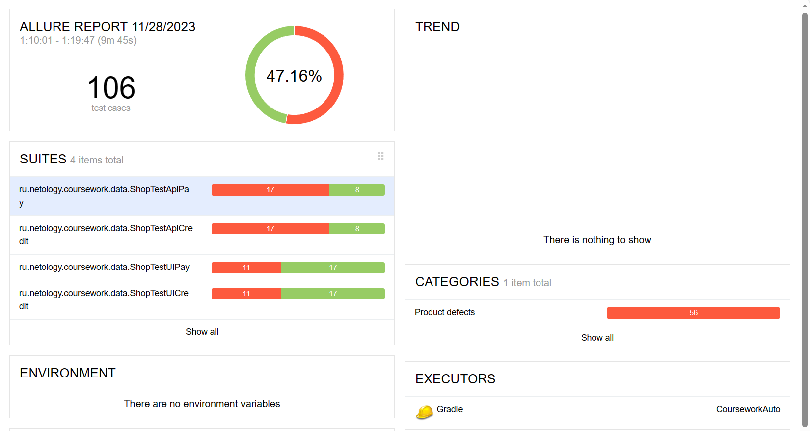

# План внедрения автоматизации

## 1. Перечень автоматизируемых сценариев.

## **1.1 Автоматизация тестирования формы, которая выходит при нажатии кнопки "Купить"**

**Предусловия:** Открыта страница приложения [http://localhost:8080/](http://localhost:8080/), нажата кнопка "Купить" или "Купить в кредит", на экран выведена форма для оплаты картой.

**Валидные данные:**

 * Поле "Номер карты"

 Допустимы: значения 1111 2222 3333 4444, 5555 6666 7777 8888 

 * Поле "Месяц"

 Допустимы: число из двух арабских цифр,значения от 01 до 12, если год стоит текущий, то не меньше текущего месяца. 

 * Поле "Год"

 Допустимы: число из двух арабских цифр (две последние цифры года), не меньше текущего года 

 Пример валидной даты: Текущий месяц текущего года

 * Поле "Владелец"

 Допустимы: латинница, пробелы (не первый и не последний), дефис (не первый и не последний), точка (не первая и не последняя), не меньше 2х символов (E. Voroshilova)

 * Поле "CVC/CVV"

 Допустимы: три арабские цифры
 

 ## **1.1.1 Отправка формы заполненной валидными данными, карта 1111 2222 3333 4444, форма "Купить"**
 
 1. Нажать кнопку "Купить"

 2. Заполнить поле "Номер карты" значением 1111 2222 3333 4444.

 3. Заполнить остальные поля валидными данными.

 4. Нажимаем кнопку "Продолжить".

 5. Сделать запрос из таблицы payment_entity статус последней операции.

 Ожидаемый результат: форма отправлена, всплывает окно с сообщение "Успешно", в таблице операция со статусом APPROVED.

## **1.1.2 Отправка формы заполненной валидными данными, карта 5555 6666 7777 8888, форма "Купить"**

 1. Нажать кнопку "Купить"

 2. Заполнить поле "Номер карты" значением 5555 6666 7777 8888.

 3. Заполнить остальные поля валидными данными.

 4. Нажимаем кнопку "Продолжить".

 5. Сделать запрос из таблицы payment_entity статус последней операции.

 Ожидаемый результат: форма отправлена, всплывает окно с сообщение "Ошибка", в таблице операция со статусом DECLINED.

## **1.1.3 Отправка формы заполненной валидными данными, невалидный номер карты (1111 1111 1111 1111), форма "Купить"**

 1. Сделать запрос на id последней операции из таблицы.

 2. Нажать кнопку "Купить" в приложении

 3. В приложении заполнить поле "Номер карты" значением 1111 1111 1111 1111.

 4. Заполнить остальные поля валидными данными.

 5. Нажимаем кнопку "Продолжить".

 6. Сделать запрос из таблицы payment_entity id последней операции и сравнить с id из п.1.

 Ожидаемый результат: форма отправлена, всплывает окно с сообщение "Ошибка", id должны совпасть (операция добавиться не должна)

## **1.1.4 Отправка формы заполненной валидными данными, карта 1111 2222 3333 4444, форма "Купить в кредит"**
 
 1. Нажать кнопку "Купить в кредит"

 2. Заполнить поле "Номер карты" значением 1111 2222 3333 4444.

 3. Заполнить остальные поля валидными данными.

 4. Нажимаем кнопку "Продолжить".

 5. Сделать запрос из таблицы credit_request_entity статус последней операции.

 Ожидаемый результат: форма отправлена, всплывает окно с сообщение "Успешно", в таблице операция со статусом APPROVED.

## **1.1.5 Отправка формы заполненной валидными данными, карта 5555 6666 7777 8888 форма "Купить в кредит"**

 1. Нажать кнопку "Купить в кредит"

 2. Заполнить поле "Номер карты" значением 5555 6666 7777 8888.

 3. Заполнить остальные поля валидными данными.

 4. Нажимаем кнопку "Продолжить".

 5. Сделать запрос из таблицы credit_request_entity последней операции.

 Ожидаемый результат: форма отправлена, всплывает окно с сообщение "Ошибка", в таблице операция со статусом DECLINED.

## **1.1.6 Отправка формы заполненной валидными данными, невалидный номер карты (1111 1111 1111 1111) форма "Купить в кредит"**

 1. Сделать запрос на id последней операции из таблицы.

 2. Нажать кнопку "Купить в кредит" в приложении

 3. В приложении заполнить поле "Номер карты" значением 1111 1111 1111 1111.

 4. Заполнить остальные поля валидными данными.

 5. Нажимаем кнопку "Продолжить".

 6. Сделать запрос из таблицы credit_request_entity id последней операции и сравнить с id из п.1.

 Ожидаемый результат: форма отправлена, всплывает окно с сообщение "Ошибка", id должны совпасть (операция добавиться не должна)

## **1.1.7 Отправка формы с невалидным номером карты (все 0)**

 1. Заполнить поле "Номер карты" значением 0000 0000 0000 0000.

 2. Заполнить остальные поля валидными данными.

 3. Нажимаем кнопку "Продолжить".

 Ожидаемый результат: форма не отправлена, всплывает окно с сообщение "Ошибка", сообщение под полем "Номер карты".

## **1.1.8 Отправка формы с пустым полем "Номер карты"**

 1. Оставить поле "Номер карты" пустым.

 2. Заполнить остальные поля валидными данными.

 3. Нажимаем кнопку "Продолжить".

 Ожидаемый результат: форма не отправлена, сообщение об ошибке под полем "Номер карты" ("Неверный формат").

## **1.1.9 Отправка формы с пустым полем "Месяц"**

 1. Оставить поле "Месяц" пустым.

 2. Заполнить остальные поля валидными данными.

 3. Нажимаем кнопку "Продолжить".

 Ожидаемый результат: форма не отправлена, сообщение об ошибке под полем "Месяц" ("Неверный формат").

## **1.1.10 Отправка формы с пустым полем "Год"**

 1. Оставить поле "Год" пустым.

 2. Заполнить остальные поля валидными данными.

 3. Нажимаем кнопку "Продолжить".

 Ожидаемый результат: форма не отправлена, сообщение об ошибке под полем "Год" ("Неверный формат").

## **1.1.11 Отправка формы с пустым полем "Владелец"**

 1. Оставить поле "Владелец" пустым.

 2. Заполнить остальные поля валидными данными.

 3. Нажимаем кнопку "Продолжить".

 Ожидаемый результат: форма не отправлена, сообщение об ошибке под полем "Владелец" ("Поле обязательно для заполнения").

## **1.1.12 Отправка формы с пустым полем "CVC/CVV"**

 1. Оставить поле "СVC/CVV" пустым.

 2. Заполнить остальные поля валидными данными.

 3. Нажимаем кнопку "Продолжить".

 Ожидаемый результат: форма не отправлена, сообщение об ошибке под полем "CVC/CVV" ("Неверный формат").

## **1.1.13 Отправка пустой формы**

 1. Оставить все поля формы пустыми

 2. Нажать кнопку "Продолжить"

 Ожидаемый результат: Сообщение об ошибке под каждым полем ("Неверный формат" под всеми полями, кроме поля "Владелец", под полем "Владелец" сообщение "Поле обязательно для заполнения").

## **1.1.14 Отправка формы с невалидным значением в поле "Год"(предыдущий год)**

 1. В поле "Год" ввести невалидное значение (последние 2 цифры прошлого года).

 2. Остальные поля заполнить валидными данными. 

 3. Нажать кнопку "Продолжить"

 Ожидаемый результат: Сообщение об ошибке под полем "Год" ("Неверный формат").

## **1.1.15 Отправка формы с невалидным значением в поле "Месяц" (предыдущий месяц)**

 1. В поле "Год" ввести две последние цифры текущего года.

 2. В поле "Месяц" ввести значение предыдущего месяца двумя арабскими цифрами, если номер месяца - 1 цифра, то перед ней поставить 0 (пример: январь - 01, ноябрь - 11).

 3. Остальные поля заполнить валидными данными.

 4. Нажать кнопку "Продолжить"

 Ожидаемый результат: Сообщение об ошибке под полем "Месяц" ("Неверный формат").

## **1.1.16 Отправка формы с невалидным значением в поле "Месяц" (00)**

 1. В поле "Месяц" ввести значение 00.

 2. Остальные поля заполнить валидными данными.

 3. Нажать кнопку "Продолжить"

 Ожидаемый результат: Сообщение об ошибке под полем "Месяц" ("Неверный формат").

## **1.1.17 Отправка формы с невалидным значением в поле "Месяц" (13)**

 1. В поле "Месяц" ввести значение 13.

 2. Остальные поля заполнить валидными данными.

 3. Нажать кнопку "Продолжить"

 Ожидаемый результат: Сообщение об ошибке под полем "Месяц" ("Неверный формат").

## **1.1.18 Отправка формы с невалидным значением в поле "Владелец" (кириллица)**

 1. В поле "Имя" ввести значение на кириллице (пример: Екатерина).

 2. Остальные поля заполнить валидными данными

 3. Нажать кнопку "Продолжить"

 Ожидаемый результат: Сообщение об ошибке под полем "Владелец" ("Неверный формат").

## **1.1.19 Отправка формы с невалидным значением в поле "Владелец" (в начале пробел)**

 1. В поле "Имя" ввести значение на латиннице с первым символом пробел (пример:  E. Voroshilova).

 2. Остальные поля заполнить валидными данными

 3. Нажать кнопку "Продолжить"

 Ожидаемый результат: Сообщение об ошибке под полем "Владелец" ("Неверный формат").

## **1.1.20 Отправка формы с невалидным значением в поле "Владелец" (в начале точка)**

 1. В поле "Имя" ввести значение на латиннице с первым символом точка (пример: .E. Voroshilova).

 2. Остальные поля заполнить валидными данными

 3. Нажать кнопку "Продолжить"

 Ожидаемый результат: Сообщение об ошибке под полем "Владелец" ("Неверный формат").

## **1.1.21 Отправка формы с невалидным значением в поле "Владелец" (в начале дефис)**

 1. В поле "Имя" ввести значение на латиннице с первым символом дефис (пример: -E. Voroshilova).

 2. Остальные поля заполнить валидными данными

 3. Нажать кнопку "Продолжить"

 Ожидаемый результат: Сообщение об ошибке под полем "Владелец" ("Неверный формат").

## **1.1.22 Отправка формы с невалидным значением в поле "Владелец" (пробел в конце)**

 1. В поле "Имя" ввести значение на латиннице с последним символом пробел (пример: E. Voroshilova ).

 2. Остальные поля заполнить валидными данными

 3. Нажать кнопку "Продолжить"

 Ожидаемый результат: Сообщение об ошибке под полем "Владелец" ("Неверный формат").

## **1.1.23 Отправка формы с невалидным значением в поле "Владелец" (точка в конце)**

 1. В поле "Имя" ввести значение на латиннице с последним символом точка (пример: E. Voroshilova.).

 2. Остальные поля заполнить валидными данными

 3. Нажать кнопку "Продолжить"

 Ожидаемый результат: Сообщение об ошибке под полем "Владелец" ("Неверный формат").

## **1.1.24 Отправка формы с невалидным значением в поле "Владелец" (дефис в конце)**

 1. В поле "Имя" ввести значение на латиннице с последним символом дефис (пример: E. Voroshilova-).

 2. Остальные поля заполнить валидными данными

 3. Нажать кнопку "Продолжить"

 Ожидаемый результат: Сообщение об ошибке под полем "Владелец" ("Неверный формат").

## **1.1.25 Отправка формы с невалидным значением в поле "Владелец" (латинница и цифры)**

 1. В поле "Имя" ввести значение из букв на латиннице и цифр (пример: E. Voroshilova1).

 2. Остальные поля заполнить валидными данными

 3. Нажать кнопку "Продолжить"

 Ожидаемый результат: Сообщение об ошибке под полем "Владелец" ("Неверный формат").

## **1.1.26 Отправка формы с невалидным значением в поле "Владелец" (латинница и спецсимволы)**

 1. В поле "Имя" ввести значение из букв на латиннице и спецсимволов (пример: E. Voroshilova@).

 2. Остальные поля заполнить валидными данными

 3. Нажать кнопку "Продолжить"

 Ожидаемый результат: Сообщение об ошибке под полем "Владелец" ("Неверный формат").
 
## **1.1.27 Отправка формы с невалидным значением в поле "Владелец" (1 символ латинницей)**

 1. В поле "Имя" ввести невалидное значение (пример:a).

 2. Остальные поля заполнить валидными данными

 3. Нажать кнопку "Продолжить"

 Ожидаемый результат: Сообщение об ошибке под полем "Владелец" ("Неверный формат").

## **1.1.28 Отправка формы с невалидным значением в поле "CVC/CVV" (не цифры)**

 1. Все поля, кроме поля "CVC/CVV" заполнить валидными значениями.

 2. Попробовать ввести в поле "CVC/CVV" что-то кроме цифр

 3. Нажать кнопку "Продолжить".

 Ожидаемый результат: Поле не дает ввести ничего, кроме цифр. Сообщение об ошибке под полем "CVC/CVV" ("Неверный формат")

## **1.1.29 Отправка формы с невалидным значением в поле "CVC/CVV" (2 цифры)**

 1. Все поля, кроме поля "CVC/CVV" заполнить валидными значениями.

 2. Ввести в поле "CVC/CVV" 2 арабские цифры

 3. Нажать кнопку "Продолжить".

 Ожидаемый результат: Поле не дает ввести ничего, кроме цифр. Сообщение об ошибке под полем "CVC/CVV" ("Неверный формат")

## **1.1.30 Отправка формы с невалидным значением в поле "CVC/CVV" (4 цифры)**

 1. Все поля, кроме поля "CVC/CVV" заполнить валидными значениями.

 2. Попробовать ввести в поле "CVC/CVV" 4 арабские цифры

 Ожидаемый результат: Поле не дает ввести цифры количеством больше 3.

## **1.2 Автоматизация API**

**Предусловия:** запущен через терминал файл aqa-shop.jar, открыта база данных для проверки записей (например в DBeaver). 

**Валидные данные:**

 * Поле "Номер карты"

 Допустимы: значения 1111 2222 3333 4444, 5555 6666 7777 8888 

 * Поле "Месяц"

 Допустимы: число из двух арабских цифр,значения от 01 до 12 (если год стоит текущий, то не меньше текущего месяца)

 * Поле "Год"

 Допустимы: число из двух арабских цифр (две последние цифры года), не меньше текущео года

 Пример валидной даты: Текущий месяц текущего года

 * Поле "Владелец"

 Допустимы: латинница, пробелы (не первый и не последний), дефис (не первый и не последний), точка (не первая и не последняя), не меньше 2х символов (E. Voroshilova)

 * Поле "CVC/CVV"

 Допустимы: три арабские цифры
 

* ## **1.2.1 Отправка запроса c валидными данными, карта 1111 2222 3333 4444**
 
 1. URL: http://localhost:8080/api/v1/pay

 2. Тело: в поле number - номер карты 1111 2222 3333 4444, year - текущий год, month - текущий месяц, holder - валидное значение поля "Владелец", cvc - валидное значение поля CVC/CVV.
 Пример:
  {  "number": "1111 2222 3333 4444",
  "year": "23",
  "month": "11",
  "holder": "E. Voroshilova",
  "cvc": "333"
 }

 3. Отправить запрос.

 4. Сделать запрос из таблицы payment_entity статус последней операции.

 Ожидаемый результат: Статус запроса: 200ОК, тело: {"status": "APPROVED"}, в таблице payment_entity операция со статусом APPROVED. 

## **1.2.2 Отправка запроса c валидными данными, карта 5555 6666 7777 8888, форма "Купить"**

 1. URL: http://localhost:8080/api/v1/pay

 2. Тело: в поле number - номер карты 5555 6666 7777 8888, year - текущий год, month - текущий месяц, holder - валидное значение поля "Владелец", cvc - валидное значение поля CVC/CVV.
 Пример:
 {  "number": "5555 6666 7777 8888",
  "year": "23",
  "month": "11",
  "holder": "E. Voroshilova",
  "cvc": "333"
 }

 3. Отправить запрос.

 4. Сделать запрос из таблицы payment_entity статус последней операции.

 Ожидаемый результат: Статус запроса: 200ОК, тело: {"status": "DECLINED"}, в таблице payment_entity операция со статусом DECLINED.

## **1.2.3 Отправка запроса c невалидным номером карты (1111 1111 1111 1111), форма "Купить"**

 1. Сделать запрос на id последней операции из таблицы payment_entity.

 2. URL: http://localhost:8080/api/v1/pay

 3. Тело: в поле number - номер карты 1111 1111 1111 1111, year - текущий год, month - текущий месяц, holder - валидное значение поля "Владелец", cvc - валидное значение поля CVC/CVV.
 Пример: 
 {  "number": "1111 1111 1111 1111",
  "year": "23",
  "month": "11",
  "holder": "E. Voroshilova",
  "cvc": "333"
 }

 4. Отправить запрос.

 5. Сделать запрос из таблицы payment_entity id последней операции и сравнить с id из п.1.

 Ожидаемый результат: Статус запроса: 500, id должны совпасть (операция добавиться не должна).

## **1.2.4 Отправка запроса c невалидным номером карты (пустым), форма "Купить"**

 1. Сделать запрос на id последней операции из таблицы payment_entity.

 2. URL: http://localhost:8080/api/v1/pay

 3. Тело: в поле number - номер карты оставить пустым, year - текущий год, month - текущий месяц, holder - валидное значение поля "Владелец", cvc - валидное значение поля CVC/CVV.
 Пример: 
 {  "number": "",
  "year": "23",
  "month": "11",
  "holder": "E. Voroshilova",
  "cvc": "333"
 }

 4. Отправить запрос.

 5. Сделать запрос из таблицы payment_entity id последней операции и сравнить с id из п.1.

 Ожидаемый результат: Статус запроса: 500, id должны совпасть (операция добавиться не должна).

## **1.2.5 Отправка запроса c невалидным номером карты (0000 0000 0000 0000), форма "Купить"**

 1. Сделать запрос на id последней операции из таблицы payment_entity.

 2. URL: http://localhost:8080/api/v1/pay

 3. Тело: в поле number - номер карты 0000 0000 0000 0000, year - текущий год, month - текущий месяц, holder - валидное значение поля "Владелец", cvc - валидное значение поля CVC/CVV.
 Пример: 
 {  "number": "0000 0000 0000 0000",
  "year": "23",
  "month": "11",
  "holder": "E. Voroshilova",
  "cvc": "333"
 }

 4. Отправить запрос.

 5. Сделать запрос из таблицы payment_entity id последней операции и сравнить с id из п.1.

 Ожидаемый результат: Статус запроса: 500, id должны совпасть (операция добавиться не должна).

## **1.2.6 Отправка пустого запроса , форма "Купить"**

 1. Сделать запрос на id последней операции из таблицы payment_entity.

 2. URL: http://localhost:8080/api/v1/pay

 3. Тело:
 {  "number": "",
  "year": "",
  "month": "",
  "holder": "",
  "cvc": ""
 }

 4. Отправить запрос.

 5. Сделать запрос из таблицы payment_entity id последней операции и сравнить с id из п.1.

 Ожидаемый результат: Статус запроса: 500, id должны совпасть (операция добавиться не должна).

## **1.2.7 Отправка пустого запроса, форма "Купить в кредит"**

 1. Сделать запрос на id последней операции из таблицы credit_request_entity.

 2. URL: http://localhost:8080/api/v1/credit

 3. Тело:
 {  "number": "",
  "year": "",
  "month": "",
  "holder": "",
  "cvc": ""
 }

 4. Отправить запрос.

 5. Сделать запрос из таблицы credit_request_entity id последней операции и сравнить с id из п.1.

 Ожидаемый результат: Статус запроса: 500, id должны совпасть (операция добавиться не должна).

## **1.2.8 Отправка запроса c валидными данными, карта 1111 2222 3333 4444, форма "Купить в кредит"**
 
1. URL: http://localhost:8080/api/v1/credit

 2. Тело: в поле number - номер карты 1111 2222 3333 4444, year - текущий год, month - текущий месяц, holder - валидное значение поля "Владелец", cvc - валидное значение поля CVC/CVV.
 Пример:
 {  "number": "1111 2222 3333 4444",
  "year": "23",
  "month": "11",
  "holder": "E. Voroshilova",
  "cvc": "333"
 }

 3. Отправить запрос.

 4. Сделать запрос из таблицы credit_request_entity статус последней операции.

 Ожидаемый результат: Статус запроса: 200ОК, тело: {"status": "APPROVED"}, в таблице credit_request_entity операция со статусом APPROVED.

## **1.2.9 Отправка запроса c валидными данными, карта 5555 6666 7777 8888 форма "Купить в кредит"**

  1. URL: http://localhost:8080/api/v1/credit

  2. Тело: в поле number - номер карты 5555 6666 7777 8888, year - текущий год, month - текущий месяц, holder - валидное значение поля "Владелец", cvc - валидное значение поля CVC/CVV.
 Пример:
 {  "number": "5555 6666 7777 8888",
  "year": "23",
  "month": "11",
  "holder": "E. Voroshilova",
  "cvc": "333"
 }

 3. Отправить запрос.

 4. Сделать запрос из таблицы credit_request_entity последней операции.

 Ожидаемый результат: Статус запроса: 200ОК, тело: {"status": "DECLINED"}, в таблице credit_request_entity операция со статусом DECLINED.

## **1.2.10 Отправка запроса c невалидным номером карты (1111 1111 1111 1111) форма "Купить в кредит"**

 1. Сделать запрос на id последней операции из таблицы credit_request_entity.

 2. URL: http://localhost:8080/api/v1/credit

 3. Тело: в поле number - номер карты 1111 1111 1111 1111, year - текущий год, month - текущий месяц, holder - валидное значение поля "Владелец", cvc - валидное значение поля CVC/CVV.
 Пример:
 {  "number": "1111 1111 1111 1111",
  "year": "23",
  "month": "11",
  "holder": "E. Voroshilova",
  "cvc": "333"
 }

 4. Отправить запрос.

 5. Сделать запрос из таблицы credit_request_entity id последней операции и сравнить с id из п.1.

 Ожидаемый результат: Статус запроса: 500, id должны совпасть (операция добавиться не должна).

## **1.2.11 Отправка запроса c невалидным номером карты (пустым), форма "Купить в кредит"**

 1. Сделать запрос на id последней операции из таблицы credit_request_entity.

 2. URL: http://localhost:8080/api/v1/credit

 3. Тело: в поле number - номер карты оставить пустым, year - текущий год, month - текущий месяц, holder - валидное значение поля "Владелец", cvc - валидное значение поля CVC/CVV.
 Пример:
 {  "number": "",
  "year": "23",
  "month": "11",
  "holder": "E. Voroshilova",
  "cvc": "333"
 }

 4. Отправить запрос.

 5. Сделать запрос из таблицы credit_request_entity id последней операции и сравнить с id из п.1.

 Ожидаемый результат: Статус запроса: 500, id должны совпасть (операция добавиться не должна).

## **1.2.12 Отправка запроса c невалидным номером карты (0000 0000 0000 0000), форма "Купить в кредит"**

 1. Сделать запрос на id последней операции из таблицы credit_request_entity.

 2. URL: http://localhost:8080/api/v1/credit

 3. Тело: в поле number - номер карты 0000 0000 0000 0000, year - текущий год, month - текущий месяц, holder - валидное значение поля "Владелец", cvc - валидное значение поля CVC/CVV.
 Пример:
 {  "number": "0000 0000 0000 0000",
  "year": "23",
  "month": "11",
  "holder": "E. Voroshilova",
  "cvc": "333"
 }

 4. Отправить запрос.

 5. Сделать запрос из таблицы credit_request_entity id последней операции и сравнить с id из п.1.

 Ожидаемый результат: Статус запроса: 500, id должны совпасть (операция добавиться не должна).

## **1.2.13 Отправка запроса c невалидным значением в поле "Год" (последние 2 цифры прошлого года), форма "Купить"**

 1. Сделать запрос на id последней операции из таблицы payment_entity.

 2. URL: http://localhost:8080/api/v1/pay

 3. Тело: в поле number - номер карты 1111 2222 3333 4444, year - последние 2 цифры прошлого года , month - текущий месяц, holder - валидное значение поля "Владелец", cvc - валидное значение поля CVC/CVV.
 Пример: 
 {  "number": "1111 2222 3333 4444",
  "year": "22",
  "month": "11",
  "holder": "E. Voroshilova",
  "cvc": "333"
 }

 4. Отправить запрос.

 5. Сделать запрос из таблицы payment_entity id последней операции и сравнить с id из п.1.

 Ожидаемый результат: Статус запроса: 400, id должны совпасть (операция добавиться не должна).

## **1.2.14 Отправка запроса c невалидным значением в поле "Год"(пустым), форма "Купить"**

 1. Сделать запрос на id последней операции из таблицы payment_entity.

 2. URL: http://localhost:8080/api/v1/pay

 3. Тело: в поле number - номер карты 1111 2222 3333 4444, year - оставить пустым, month - текущий месяц, holder - валидное значение поля "Владелец", cvc - валидное значение поля CVC/CVV.
 Пример: 
 {  "number": "1111 2222 3333 4444",
  "year": "",
  "month": "11",
  "holder": "E. Voroshilova",
  "cvc": "333"
 }

 4. Отправить запрос.

 5. Сделать запрос из таблицы payment_entity id последней операции и сравнить с id из п.1.

 Ожидаемый результат: Статус запроса: 400, id должны совпасть (операция добавиться не должна).

## **1.2.15 Отправка запроса c невалидным значением в поле "Год"(буквы,символы), форма "Купить"**

 1. Сделать запрос на id последней операции из таблицы payment_entity.

 2. URL: http://localhost:8080/api/v1/pay

 3. Тело: в поле number - номер карты 1111 2222 3333 4444, year - ввести буквы или любые символы, month - текущий месяц, holder - валидное значение поля "Владелец", cvc - валидное значение поля CVC/CVV.
 Пример: 
 {  "number": "1111 2222 3333 4444",
  "year": "ye@r",
  "month": "11",
  "holder": "E. Voroshilova",
  "cvc": "333"
 }

 4. Отправить запрос.

 5. Сделать запрос из таблицы payment_entity id последней операции и сравнить с id из п.1.

 Ожидаемый результат: Статус запроса: 400, id должны совпасть (операция добавиться не должна).

## **1.2.16 Отправка запроса c невалидным значением в поле "Год" (последние 2 цифры прошлого года), форма "Купить в кредит"**

 1. Сделать запрос на id последней операции из таблицы credit_request_entity

 2. URL: http://localhost:8080/api/v1/credit

 3. Тело: в поле number - номер карты 1111 2222 3333 4444, year - последние 2 цифры прошлого года , month - текущий месяц, holder - валидное значение поля "Владелец", cvc - валидное значение поля CVC/CVV.
 Пример: 
 {  "number": "1111 2222 3333 4444",
  "year": "22",
  "month": "11",
  "holder": "E. Voroshilova",
  "cvc": "333"
 }

 4. Отправить запрос.

 5. Сделать запрос из таблицы credit_request_entity id последней операции и сравнить с id из п.1.

 Ожидаемый результат: Статус запроса: 400, id должны совпасть (операция добавиться не должна).

## **1.2.17 Отправка запроса c невалидным значением в поле "Год"(пустым), форма "Купить в кредит"**

 1. Сделать запрос на id последней операции из таблицы credit_request_entity.

 2. URL: http://localhost:8080/api/v1/credit

 3. Тело: в поле number - номер карты 1111 2222 3333 4444, year - оставить пустым, month - текущий месяц, holder - валидное значение поля "Владелец", cvc - валидное значение поля CVC/CVV.
 Пример: 
 {  "number": "1111 2222 3333 4444",
  "year": "",
  "month": "11",
  "holder": "E. Voroshilova",
  "cvc": "333"
 }

 4. Отправить запрос.

 5. Сделать запрос из таблицы credit_request_entity id последней операции и сравнить с id из п.1.

 Ожидаемый результат: Статус запроса: 400, id должны совпасть (операция добавиться не должна).

## **1.2.18 Отправка запроса c невалидным значением в поле "Год"(буквы,символы), форма "Купить в кредит"**

 1. Сделать запрос на id последней операции из таблицы credit_request_entity.

 2. URL: http://localhost:8080/api/v1/credit

 3. Тело: в поле number - номер карты 1111 2222 3333 4444, year - ввести буквы или любые символы, month - текущий месяц, holder - валидное значение поля "Владелец", cvc - валидное значение поля CVC/CVV.
 Пример: 
 {  "number": "1111 2222 3333 4444",
  "year": "ye@r",
  "month": "11",
  "holder": "E. Voroshilova",
  "cvc": "333"
 }

 4. Отправить запрос.

 5. Сделать запрос из таблицы credit_request_entity id последней операции и сравнить с id из п.1.

 Ожидаемый результат: Статус запроса: 400, id должны совпасть (операция добавиться не должна).

## **1.2.19 Отправка запроса c невалидным значением в поле "Месяц" (ввести значение предыдущего месяца двумя арабскими цифрами, если номер месяца - 1 цифра, то перед ней поставить 0 (пример: январь - 01, ноябрь - 11)), форма "Купить"**

 1. Сделать запрос на id последней операции из таблицы payment_entity.

 2. URL: http://localhost:8080/api/v1/pay

 3. Тело: в поле number - номер карты 1111 2222 3333 4444, year - текущий год , month -  ввести значение предыдущего месяца двумя арабскими цифрами, если номер месяца - 1 цифра, то перед ней поставить 0 (пример: январь - 01, ноябрь - 11), holder - валидное значение поля "Владелец", cvc - валидное значение поля CVC/CVV.
 Пример: 
 {  "number": "1111 2222 3333 4444",
  "year": "23",
  "month": "10",
  "holder": "E. Voroshilova",
  "cvc": "333"
 }

 4. Отправить запрос.

 5. Сделать запрос из таблицы payment_entity id последней операции и сравнить с id из п.1.

 Ожидаемый результат: Статус запроса: 400, id должны совпасть (операция добавиться не должна).

## **1.2.20 Отправка запроса c невалидным значением в поле "Месяц"(пустым), форма "Купить"**

 1. Сделать запрос на id последней операции из таблицы payment_entity.

 2. URL: http://localhost:8080/api/v1/pay

 3. Тело: в поле number - номер карты 1111 2222 3333 4444, year - текущий год , month -  оставить пустым, holder - валидное значение поля "Владелец", cvc - валидное значение поля CVC/CVV.
 Пример: 
 {  "number": "1111 2222 3333 4444",
  "year": "23",
  "month": "",
  "holder": "E. Voroshilova",
  "cvc": "333"
 }

 4. Отправить запрос.

 5. Сделать запрос из таблицы payment_entity id последней операции и сравнить с id из п.1.

 Ожидаемый результат: Статус запроса: 400, id должны совпасть (операция добавиться не должна).

## **1.2.21 Отправка запроса c невалидным значением в поле "Месяц" (буквы,символы), форма "Купить"**

 1. Сделать запрос на id последней операции из таблицы payment_entity.

 2. URL: http://localhost:8080/api/v1/pay

 3. Тело: в поле number - номер карты 1111 2222 3333 4444, year - текущий год , month -  ввести буквы или любые символы, holder - валидное значение поля "Владелец", cvc - валидное значение поля CVC/CVV.
 Пример: 
 {  "number": "1111 2222 3333 4444",
  "year": "23",
  "month": "month!",
  "holder": "E. Voroshilova",
  "cvc": "333"
 }

 4. Отправить запрос.

 5. Сделать запрос из таблицы payment_entity id последней операции и сравнить с id из п.1.

 Ожидаемый результат: Статус запроса: 400, id должны совпасть (операция добавиться не должна).

## **1.2.22 Отправка запроса c невалидным значением в поле "Месяц" (ввести значение предыдущего месяца двумя арабскими цифрами, если номер месяца - 1 цифра, то перед ней поставить 0 (пример: январь - 01, ноябрь - 11)), форма "Купить в кредит"**

 1. Сделать запрос на id последней операции из таблицы credit_request_entity.

 2. URL: http://localhost:8080/api/v1/credit

 3. Тело: в поле number - номер карты 1111 2222 3333 4444, year - текущий год , month -  ввести значение предыдущего месяца двумя арабскими цифрами, если номер месяца - 1 цифра, то перед ней поставить 0 (пример: январь - 01, ноябрь - 11), holder - валидное значение поля "Владелец", cvc - валидное значение поля CVC/CVV.
 Пример: 
 {  "number": "1111 2222 3333 4444",
  "year": "23",
  "month": "10",
  "holder": "E. Voroshilova",
  "cvc": "333"
 }

 4. Отправить запрос.

 5. Сделать запрос из таблицы credit_request_entity id последней операции и сравнить с id из п.1.

 Ожидаемый результат: Статус запроса: 400, id должны совпасть (операция добавиться не должна).

## **1.2.23 Отправка запроса c невалидным значением в поле "Месяц"(пустым), форма "Купить в кредит"**

 1. Сделать запрос на id последней операции из таблицы credit_request_entity.

 2. URL: http://localhost:8080/api/v1/credit

 3. Тело: в поле number - номер карты 1111 2222 3333 4444, year - текущий год , month -  оставить пустым, holder - валидное значение поля "Владелец", cvc - валидное значение поля CVC/CVV.
 Пример: 
 {  "number": "1111 2222 3333 4444",
  "year": "23",
  "month": "",
  "holder": "E. Voroshilova",
  "cvc": "333"
 }

 4. Отправить запрос.

 5. Сделать запрос из таблицы credit_request_entity id последней операции и сравнить с id из п.1.

 Ожидаемый результат: Статус запроса: 400, id должны совпасть (операция добавиться не должна).

## **1.2.24 Отправка запроса c невалидным значением в поле "Месяц" (буквы,символы), форма "Купить в кредит"**

 1. Сделать запрос на id последней операции из таблицы credit_request_entity.

 2. URL: http://localhost:8080/api/v1/credit

 3. Тело: в поле number - номер карты 1111 2222 3333 4444, year - текущий год , month -  ввести буквы или любые символы, holder - валидное значение поля "Владелец", cvc - валидное значение поля CVC/CVV.
 Пример: 
 {  "number": "1111 2222 3333 4444",
  "year": "23",
  "month": "month!",
  "holder": "E. Voroshilova",
  "cvc": "333"
 }

 4. Отправить запрос.

 5. Сделать запрос из таблицы credit_request_entity id последней операции и сравнить с id из п.1.

 Ожидаемый результат: Статус запроса: 400, id должны совпасть (операция добавиться не должна).

## **1.2.25 Отправка запроса c невалидным значением в поле "Владелец" (кириллица), форма "Купить"**

 1. Сделать запрос на id последней операции из таблицы payment_entity.

 2. URL: http://localhost:8080/api/v1/pay

 3. Тело: в поле number - номер карты 1111 2222 3333 4444, year - текущий год , month -  текущий месяц, holder - имя на кириллице, cvc - валидное значение поля CVC/CVV.
 Пример: 
 {  "number": "1111 2222 3333 4444",
  "year": "23",
  "month": "11",
  "holder": "Екатерина",
  "cvc": "333"
 }

 4. Отправить запрос.

 5. Сделать запрос из таблицы payment_entity, id последней операции и сравнить с id из п.1.

 Ожидаемый результат: Статус запроса: 400, id должны совпасть (операция добавиться не должна).

## **1.2.26 Отправка запроса c невалидным значением в поле"Владелец" (в начале пробел), форма "Купить"**

 1. Сделать запрос на id последней операции из таблицы payment_entity.

 2. URL: http://localhost:8080/api/v1/pay

 3. Тело: в поле number - номер карты 1111 2222 3333 4444, year - текущий год , month -  текущий месяц, holder - валидное значение + пробел в начале, cvc - валидное значение поля CVC/CVV.
 Пример: 
 {  "number": "1111 2222 3333 4444",
  "year": "23",
  "month": "11",
  "holder": " E. Voroshilova",
  "cvc": "333"
 }

 4. Отправить запрос.

 5. Сделать запрос из таблицы payment_entity, id последней операции и сравнить с id из п.1.

 Ожидаемый результат: Статус запроса: 400, id должны совпасть (операция добавиться не должна).

## **1.2.27 Отправка запроса c невалидным значением в поле "Владелец" (в начале точка), форма "Купить"**

 1. Сделать запрос на id последней операции из таблицы payment_entity.

 2. URL: http://localhost:8080/api/v1/pay

 3. Тело: в поле number - номер карты 1111 2222 3333 4444, year - текущий год , month -  текущий месяц, holder - валидное значение + точка в начале, cvc - валидное значение поля CVC/CVV.
 Пример: 
 {  "number": "1111 2222 3333 4444",
  "year": "23",
  "month": "11",
  "holder": ".E. Voroshilova",
  "cvc": "333"
 }

 4. Отправить запрос.

 5. Сделать запрос из таблицы payment_entity, id последней операции и сравнить с id из п.1.

 Ожидаемый результат: Статус запроса: 400, id должны совпасть (операция добавиться не должна).

## **1.2.28 Отправка запроса с невалидным значением в поле "Владелец" (в начале дефис), форма "Купить"**

 1. Сделать запрос на id последней операции из таблицы payment_entity.

 2. URL: http://localhost:8080/api/v1/pay

 3. Тело: в поле number - номер карты 1111 2222 3333 4444, year - текущий год , month -  текущий месяц, holder - валидное значение + дефис в начале, cvc - валидное значение поля CVC/CVV.
 Пример: 
 {  "number": "1111 2222 3333 4444",
  "year": "23",
  "month": "11",
  "holder": "-E. Voroshilova",
  "cvc": "333"
 }

 4. Отправить запрос.

 5. Сделать запрос из таблицы payment_entity, id последней операции и сравнить с id из п.1.

 Ожидаемый результат: Статус запроса: 400, id должны совпасть (операция добавиться не должна).

## **1.2.29 Отправка запроса с невалидным значением в поле "Владелец" (пробел в конце), форма "Купить**

 1. Сделать запрос на id последней операции из таблицы payment_entity.

 2. URL: http://localhost:8080/api/v1/pay

 3. Тело: в поле number - номер карты 1111 2222 3333 4444, year - текущий год , month -  текущий месяц, holder - валидное значение + пробел в конце, cvc - валидное значение поля CVC/CVV.
 Пример: 
 {  "number": "1111 2222 3333 4444",
  "year": "23",
  "month": "11",
  "holder": "E. Voroshilova ",
  "cvc": "333"
 }

 4. Отправить запрос.

 5. Сделать запрос из таблицы payment_entity, id последней операции и сравнить с id из п.1.

 Ожидаемый результат: Статус запроса: 400, id должны совпасть (операция добавиться не должна).

## **1.2.30 Отправка запроса с невалидным значением в поле "Владелец" (точка в конце), форма "Купить"**

 1. Сделать запрос на id последней операции из таблицы payment_entity.

 2. URL: http://localhost:8080/api/v1/pay

 3. Тело: в поле number - номер карты 1111 2222 3333 4444, year - текущий год , month -  текущий месяц, holder - валидное значение + точка в конце, cvc - валидное значение поля CVC/CVV.
 Пример: 
 {  "number": "1111 2222 3333 4444",
  "year": "23",
  "month": "11",
  "holder": "E. Voroshilova.",
  "cvc": "333"
 }

 4. Отправить запрос.

 5. Сделать запрос из таблицы payment_entity, id последней операции и сравнить с id из п.1.

 Ожидаемый результат: Статус запроса: 400, id должны совпасть (операция добавиться не должна).

## **1.2.31 Отправка запроса с невалидным значением в поле "Владелец" (дефис в конце), форма "Купить"**

 1. Сделать запрос на id последней операции из таблицы payment_entity.

 2. URL: http://localhost:8080/api/v1/pay

 3. Тело: в поле number - номер карты 1111 2222 3333 4444, year - текущий год , month -  текущий месяц, holder - валидное значение + дефис в конце, cvc - валидное значение поля CVC/CVV.
 Пример: 
 {  "number": "1111 2222 3333 4444",
  "year": "23",
  "month": "11",
  "holder": "E. Voroshilova-",
  "cvc": "333"
 }

 4. Отправить запрос.

 5. Сделать запрос из таблицы payment_entity, id последней операции и сравнить с id из п.1.

 Ожидаемый результат: Статус запроса: 400, id должны совпасть (операция добавиться не должна).

## **1.2.32 Отправка запроса с невалидным значением в поле "Владелец" (латинница и цифры), форма "Купить"**

 1. Сделать запрос на id последней операции из таблицы payment_entity.

 2. URL: http://localhost:8080/api/v1/pay

 3. Тело: в поле number - номер карты 1111 2222 3333 4444, year - текущий год , month -  текущий месяц, holder - валидное значение + цифры, cvc - валидное значение поля CVC/CVV.
 Пример: 
 {  "number": "1111 2222 3333 4444",
  "year": "23",
  "month": "11",
  "holder": "E. Voroshilova123",
  "cvc": "333"
 }

 4. Отправить запрос.

 5. Сделать запрос из таблицы payment_entity, id последней операции и сравнить с id из п.1.

 Ожидаемый результат: Статус запроса: 400, id должны совпасть (операция добавиться не должна).

## **1.2.33 Отправка формы с невалидным значением в поле "Владелец" (латинница и спецсимволы), форма "Купить"**

 1. Сделать запрос на id последней операции из таблицы payment_entity.

 2. URL: http://localhost:8080/api/v1/pay

 3. Тело: в поле number - номер карты 1111 2222 3333 4444, year - текущий год , month -  текущий месяц, holder - латинница + спецсимволы, cvc - валидное значение поля CVC/CVV.
 Пример: 
 {  "number": "1111 2222 3333 4444",
  "year": "23",
  "month": "11",
  "holder": "E. Voroshilov@",
  "cvc": "333"
 }

 4. Отправить запрос.

 5. Сделать запрос из таблицы payment_entity, id последней операции и сравнить с id из п.1.

 Ожидаемый результат: Статус запроса: 400, id должны совпасть (операция добавиться не должна).
 
## **1.2.34 Отправка формы с невалидным значением в поле "Владелец" (пустым), форма "Купить"**

 1. Сделать запрос на id последней операции из таблицы payment_entity.

 2. URL: http://localhost:8080/api/v1/pay

 3. Тело: в поле number - номер карты 1111 2222 3333 4444, year - текущий год , month -  текущий месяц, holder - оставить пустым, cvc - валидное значение поля CVC/CVV.
 Пример: 
 {  "number": "1111 2222 3333 4444",
  "year": "23",
  "month": "11",
  "holder": "",
  "cvc": "333"
 }

 4. Отправить запрос.

 5. Сделать запрос из таблицы payment_entity, id последней операции и сравнить с id из п.1.

 Ожидаемый результат: Статус запроса: 400, id должны совпасть (операция добавиться не должна).

## **1.2.35 Отправка запроса c невалидным значением в поле "Владелец" (кириллица), форма "Купить в кредит"**

  1. Сделать запрос на id последней операции из таблицы credit_request_entity.

 2. URL: http://localhost:8080/api/v1/credit

 3. Тело: в поле number - номер карты 1111 2222 3333 4444, year - текущий год , month -  текущий месяц, holder - имя на кириллице, cvc - валидное значение поля CVC/CVV.
 Пример: 
 {  "number": "1111 2222 3333 4444",
  "year": "23",
  "month": "11",
  "holder": "Екатерина",
  "cvc": "333"
 }

 4. Отправить запрос.

 5. Сделать запрос из таблицы credit_request_entity, id последней операции и сравнить с id из п.1.

 Ожидаемый результат: Статус запроса: 400, id должны совпасть (операция добавиться не должна).

## **1.2.36 Отправка запроса c невалидным значением в поле"Владелец" (в начале пробел), форма "Купить в кредит"**

 1. Сделать запрос на id последней операции из таблицы credit_request_entity.

 2. URL: http://localhost:8080/api/v1/credit

 3. Тело: в поле number - номер карты 1111 2222 3333 4444, year - текущий год , month -  текущий месяц, holder - валидное значение + пробел в начале, cvc - валидное значение поля CVC/CVV.
 Пример: 
 {  "number": "1111 2222 3333 4444",
  "year": "23",
  "month": "11",
  "holder": " E. Voroshilova",
  "cvc": "333"
 }

 4. Отправить запрос.

 5. Сделать запрос из таблицы credit_request_entity, id последней операции и сравнить с id из п.1.

 Ожидаемый результат: Статус запроса: 400, id должны совпасть (операция добавиться не должна).

## **1.2.37 Отправка запроса c невалидным значением в поле "Владелец" (в начале точка), форма "Купить в кредит"**

 1. Сделать запрос на id последней операции из таблицы credit_request_entity.

 2. URL: http://localhost:8080/api/v1/pay

 3. Тело: в поле number - номер карты 1111 2222 3333 4444, year - текущий год , month -  текущий месяц, holder - валидное значение + точка в начале, cvc - валидное значение поля CVC/CVV.
 Пример: 
 {  "number": "1111 2222 3333 4444",
  "year": "23",
  "month": "11",
  "holder": ".E. Voroshilova",
  "cvc": "333"
 }

 4. Отправить запрос.

 5. Сделать запрос из таблицы credit_request_entity, id последней операции и сравнить с id из п.1.

 Ожидаемый результат: Статус запроса: 400, id должны совпасть (операция добавиться не должна).

## **1.2.38 Отправка запроса с невалидным значением в поле "Владелец" (в начале дефис), форма "Купить в кредит"**

 1. Сделать запрос на id последней операции из таблицы credit_request_entity.

 2. URL: http://localhost:8080/api/v1/credit

 3. Тело: в поле number - номер карты 1111 2222 3333 4444, year - текущий год , month -  текущий месяц, holder - валидное значение + дефис в начале, cvc - валидное значение поля CVC/CVV.
 Пример: 
 {  "number": "1111 2222 3333 4444",
  "year": "23",
  "month": "11",
  "holder": "-E. Voroshilova",
  "cvc": "333"
 }

 4. Отправить запрос.

 5. Сделать запрос из таблицы credit_request_entity, id последней операции и сравнить с id из п.1.

 Ожидаемый результат: Статус запроса: 400, id должны совпасть (операция добавиться не должна).

## **1.2.39 Отправка запроса с невалидным значением в поле "Владелец" (пробел в конце), форма "Купить в кредит**

 1. Сделать запрос на id последней операции из таблицы credit_request_entity.

 2. URL: http://localhost:8080/api/v1/credit

 3. Тело: в поле number - номер карты 1111 2222 3333 4444, year - текущий год , month -  текущий месяц, holder - валидное значение + пробел в конце, cvc - валидное значение поля CVC/CVV.
 Пример: 
 {  "number": "1111 2222 3333 4444",
  "year": "23",
  "month": "11",
  "holder": "E. Voroshilova ",
  "cvc": "333"
 }

 4. Отправить запрос.

 5. Сделать запрос из таблицы credit_request_entity, id последней операции и сравнить с id из п.1.

 Ожидаемый результат: Статус запроса: 400, id должны совпасть (операция добавиться не должна).

## **1.2.40 Отправка запроса с невалидным значением в поле "Владелец" (точка в конце), форма "Купить в кредит"**

 1. Сделать запрос на id последней операции из таблицы credit_request_entity.

 2. URL: http://localhost:8080/api/v1/credit

 3. Тело: в поле number - номер карты 1111 2222 3333 4444, year - текущий год , month -  текущий месяц, holder - валидное значение + точка в конце, cvc - валидное значение поля CVC/CVV.
 Пример: 
 {  "number": "1111 2222 3333 4444",
  "year": "23",
  "month": "11",
  "holder": "E. Voroshilova.",
  "cvc": "333"
 }

 4. Отправить запрос.

 5. Сделать запрос из таблицы credit_request_entity, id последней операции и сравнить с id из п.1.

 Ожидаемый результат: Статус запроса: 400, id должны совпасть (операция добавиться не должна).

## **1.2.41 Отправка запроса с невалидным значением в поле "Владелец" (дефис в конце), форма "Купить в кредит"**

 1. Сделать запрос на id последней операции из таблицы credit_request_entity.

 2. URL: http://localhost:8080/api/v1/credit

 3. Тело: в поле number - номер карты 1111 2222 3333 4444, year - текущий год , month -  текущий месяц, holder - валидное значение + дефис в конце, cvc - валидное значение поля CVC/CVV.
 Пример: 
 {  "number": "1111 2222 3333 4444",
  "year": "23",
  "month": "11",
  "holder": "E. Voroshilova-",
  "cvc": "333"
 }

 4. Отправить запрос.

 5. Сделать запрос из таблицы credit_request_entity, id последней операции и сравнить с id из п.1.

 Ожидаемый результат: Статус запроса: 400, id должны совпасть (операция добавиться не должна).

## **1.2.42 Отправка запроса с невалидным значением в поле "Владелец" (латинница и цифры), форма "Купить в кредит"**

 1. Сделать запрос на id последней операции из таблицы credit_request_entity.

 2. URL: http://localhost:8080/api/v1/credit

 3. Тело: в поле number - номер карты 1111 2222 3333 4444, year - текущий год , month -  текущий месяц, holder - валидное значение + цифры, cvc - валидное значение поля CVC/CVV.
 Пример: 
 {  "number": "1111 2222 3333 4444",
  "year": "23",
  "month": "11",
  "holder": "E. Voroshilova123",
  "cvc": "333"
 }

 4. Отправить запрос.

 5. Сделать запрос из таблицы credit_request_entity, id последней операции и сравнить с id из п.1.

 Ожидаемый результат: Статус запроса: 400, id должны совпасть (операция добавиться не должна).

## **1.2.43 Отправка формы с невалидным значением в поле "Владелец" (латинница и спецсимволы), форма "Купить в кредит"**

 1. Сделать запрос на id последней операции из таблицы credit_request_entity.

 2. URL: http://localhost:8080/api/v1/credit

 3. Тело: в поле number - номер карты 1111 2222 3333 4444, year - текущий год , month -  текущий месяц, holder - латинница + спецсимволы, cvc - валидное значение поля CVC/CVV.
 Пример: 
 {  "number": "1111 2222 3333 4444",
  "year": "23",
  "month": "11",
  "holder": "E. Voroshilov@",
  "cvc": "333"
 }

 4. Отправить запрос.

 5. Сделать запрос из таблицы credit_request_entity, id последней операции и сравнить с id из п.1.

 Ожидаемый результат: Статус запроса: 400, id должны совпасть (операция добавиться не должна).
 
## **1.2.44 Отправка формы с невалидным значением в поле "Владелец" (пустым), форма "Купить в кредит"**

 1. Сделать запрос на id последней операции из таблицы credit_request_entity.

 2. URL: http://localhost:8080/api/v1/credit

 3. Тело: в поле number - номер карты 1111 2222 3333 4444, year - текущий год , month -  текущий месяц, holder - оставить пустым, cvc - валидное значение поля CVC/CVV.
 Пример: 
 {  "number": "1111 2222 3333 4444",
  "year": "23",
  "month": "11",
  "holder": "",
  "cvc": "333"
 }

 4. Отправить запрос.

 5. Сделать запрос из таблицы credit_request_entity, id последней операции и сравнить с id из п.1.

 Ожидаемый результат: Статус запроса: 400, id должны совпасть (операция добавиться не должна).

## **1.2.45 Отправка запроса c невалидным CVV (с буквами), форма "Купить в кредит"**

 1. Сделать запрос на id последней операции из таблицы сredit_request_entity.

 2. URL: http://localhost:8080/api/v1/сredit

 3. Тело: в поле number - номер карты 1111 2222 3333 4444, year - текущий год , month -  текущий месяц, holder - валидное значение поля "Владелец", cvc - ввести цифры с бууквами - 3 символа.
 Пример:
 {  "number": "1111 2222 3333 4444",
  "year": "23",
  "month": "11",
  "holder": "E. Voroshilova",
  "cvc": "3ab"
 }

 4. Отправить запрос.

 5. Сделать запрос из таблицы сredit_request_entity id последней операции и сравнить с id из п.1.

 Ожидаемый результат: Статус запроса: 400, id должны совпасть (операция добавиться не должна).

## **1.2.46 Отправка запроса c невалидным CVV (4 цифры), форма "Купить в кредит"**

 1. Сделать запрос на id последней операции из таблицы сredit_request_entity.

 2. URL: http://localhost:8080/api/v1/сredit

 3. Тело: в поле number - номер карты 1111 2222 3333 4444, year - текущий год , month -  текущий месяц, holder - валидное значение поля "Владелец", cvc - четыре цифры.
 Пример:
 {  "number": "1111 2222 3333 4444",
  "year": "23",
  "month": "11",
  "holder": "E. Voroshilova",
  "cvc": "3333"
 }

 4. Отправить запрос.

 5. Сделать запрос из таблицы сredit_request_entity id последней операции и сравнить с id из п.1.

 Ожидаемый результат: Статус запроса: 400, id должны совпасть (операция добавиться не должна).

## **1.2.47 Отправка запроса c невалидным CVV (2 цифры), форма "Купить в кредит"**

 1. Сделать запрос на id последней операции из таблицы сredit_request_entity.

 2. URL: http://localhost:8080/api/v1/сredit

 3. Тело: в поле number - номер карты 1111 2222 3333 4444, year - текущий год , month -  текущий месяц, holder - валидное значение поля "Владелец", cvc - две цифры.
 Пример:
 {  "number": "1111 2222 3333 4444",
  "year": "23",
  "month": "11",
  "holder": "E. Voroshilova",
  "cvc": "33"
 }

 4. Отправить запрос.

 5. Сделать запрос из таблицы сredit_request_entity id последней операции и сравнить с id из п.1.

 Ожидаемый результат: Статус запроса: 400, id должны совпасть (операция добавиться не должна).

## **1.2.48 Отправка запроса c пустым полем CVV, форма "Купить в кредит"**

 1. Сделать запрос на id последней операции из таблицы сredit_request_entity.

 2. URL: http://localhost:8080/api/v1/сredit

 3. Тело: в поле number - номер карты 1111 2222 3333 4444, year - текущий год , month -  текущий месяц, holder - валидное значение поля "Владелец", cvc - оставить пустым.
 Пример:
 {  "number": "1111 2222 3333 4444",
  "year": "23",
  "month": "11",
  "holder": "E. Voroshilova",
  "cvc": ""
 }

 4. Отправить запрос.

 5. Сделать запрос из таблицы сredit_request_entity id последней операции и сравнить с id из п.1.

 Ожидаемый результат: Статус запроса: 400, id должны совпасть (операция добавиться не должна).

## **1.2.49 Отправка запроса c невалидным CVV (с буквами), форма "Купить"**

 1. Сделать запрос на id последней операции из таблицы payment_entity.

 2. URL: http://localhost:8080/api/v1/pay

 3. Тело: в поле number - номер карты 1111 2222 3333 4444, year - текущий год , month -  текущий месяц, holder - валидное значение поля "Владелец", cvc - ввести цифры с бууквами - 3 символа.
 Пример:
 {  "number": "1111 2222 3333 4444",
  "year": "23",
  "month": "11",
  "holder": "E. Voroshilova",
  "cvc": "3ab"
 }

 4. Отправить запрос.

 5. Сделать запрос из таблицы payment_entity id последней операции и сравнить с id из п.1.

 Ожидаемый результат: Статус запроса: 400, id должны совпасть (операция добавиться не должна).

## **1.2.50 Отправка запроса c невалидным CVV (4 цифры), форма "Купить"**

 1. Сделать запрос на id последней операции из таблицы payment_entity.

 2. URL: http://localhost:8080/api/v1/pay

 3. Тело: в поле number - номер карты 1111 2222 3333 4444, year - текущий год , month -  текущий месяц, holder - валидное значение поля "Владелец", cvc - четыре цифры.
 Пример:
 {  "number": "1111 2222 3333 4444",
  "year": "23",
  "month": "11",
  "holder": "E. Voroshilova",
  "cvc": "3333"
 }

 4. Отправить запрос.

 5. Сделать запрос из таблицы payment_entity id последней операции и сравнить с id из п.1.

 Ожидаемый результат: Статус запроса: 400, id должны совпасть (операция добавиться не должна).

## **1.2.51 Отправка запроса c невалидным CVV (2 цифры), форма "Купить"**

 1. Сделать запрос на id последней операции из таблицы payment_entity.

 2. URL: http://localhost:8080/api/v1/pay

 3. Тело: в поле number - номер карты 1111 2222 3333 4444, year - текущий год , month -  текущий месяц, holder - валидное значение поля "Владелец", cvc - две цифры.
 Пример:
 {  "number": "1111 2222 3333 4444",
  "year": "23",
  "month": "11",
  "holder": "E. Voroshilova",
  "cvc": "33"
 }

 4. Отправить запрос.

 5. Сделать запрос из таблицы payment_entity id последней операции и сравнить с id из п.1.

 Ожидаемый результат: Статус запроса: 400, id должны совпасть (операция добавиться не должна).

## **1.2.52 Отправка запроса c пустым полем CVV, форма "Купить"**

 1. Сделать запрос на id последней операции из таблицы payment_entity.

 2. URL: http://localhost:8080/api/v1/pay

 3. Тело: в поле number - номер карты 1111 2222 3333 4444, year - текущий год , month -  текущий месяц, holder - валидное значение поля "Владелец", cvc - оставить пустым.
 Пример:
 {  "number": "1111 2222 3333 4444",
  "year": "23",
  "month": "11",
  "holder": "E. Voroshilova",
  "cvc": ""
 }

 4. Отправить запрос.

 5. Сделать запрос из таблицы payment_entity id последней операции и сравнить с id из п.1.

 Ожидаемый результат: Статус запроса: 400, id должны совпасть (операция добавиться не должна).

## 2. Перечень используемых инструментов с обоснованием выбора.

 * JDK (Java Development Kit) - набор программ для разработки. Именно его мы (или редактор) устанавливаем к себе на компьютер, чтобы заниматься разработкой на Java. Он включает в себя JRE, загрузчик кода java, компилятор javac, архиватор jar, генератор документации javadoc и другие утилиты, нужные во время разработки.

 * JUnit – является одним из самых популярных инструментов для тестирования Java-кода. Он предоставляет простой и удобный способ написания автоматических тестов, а также обеспечивает множество встроенных функций для тестирования, таких как проверка условий и сравнения значений. JUnit также обладает хорошей документацией и большим сообществом пользователей, что обеспечивает быструю поддержку и развитие инструмента.

 * Selenide - основан на Selenium WebDriver, предоставляет простой и понятный API для написания тестов. Одной из главных проблем при тестировании веб-приложений является ожидание изменений в DOM-структуре и загрузки AJAX-контента. Selenide решает эту проблему путем автоматического ожидания элементов и проверки их состояния. Это упрощает написание тестов и делает их более стабильными.

 Selenide также обладает рядом удобных функций, таких как автоматические скриншоты при ошибке, автоматический запуск и остановка браузера, а также простой API для работы с элементами страницы. Инструмент поддерживает несколько популярных фреймворков, таких как JUnit, TestNG и Cucumber, что позволяет интегрировать его в любой проект.

 * DevTools — это инструменты разработчика в браузерах, которые помогают в создании, тестировании, оптимизации сайтов.

 * Faker — это библиотека, которая позволяет генерировать случайные данные. С ее помощью можно заполнить таблицы в базе данных, построить корректные XML-документы, сформировать JSON-ответы для REST

 * Postman - тестирование API

 * DBeaver - риложение, предназначенное для управления базами данных.

 Инструменты тестирования Java-кода предоставляют множество возможностей для написания автоматических тестов и обеспечивают высокий уровень надежности и безопасности Java-приложений. Выбор конкретного инструмента зависит от конкретных потребностей проекта и команды разработчиков, однако использование любого из перечисленных инструментов поможет существенно улучшить качество и надежность Java-кода.

## 3. Перечень и описание возможных рисков при автоматизации.

 * Риск увеличить бюджет проекта (съем помещений, зар.плата)
 * Увеличение времени (болезнь, неверно выбранные инструменты, технические проблемы, поиск уникальных инструментов на странице без тестовых меток)

## 4. Интервальная оценка с учётом рисков в часах.
 Примерно 32 часа (сдать до 28.11.2023) с учетом рисков.

## 5. План сдачи работ: когда будут проведены автотесты, результаты их проведения и отчёт по автоматизации.
 Планирую сдать работу полностью до 28.11.2023 (болеет ребенок), возможно раньше. Тесты до 25.11. Оформление баг-репортов, настройка CI и оформление отчетности до 28.11