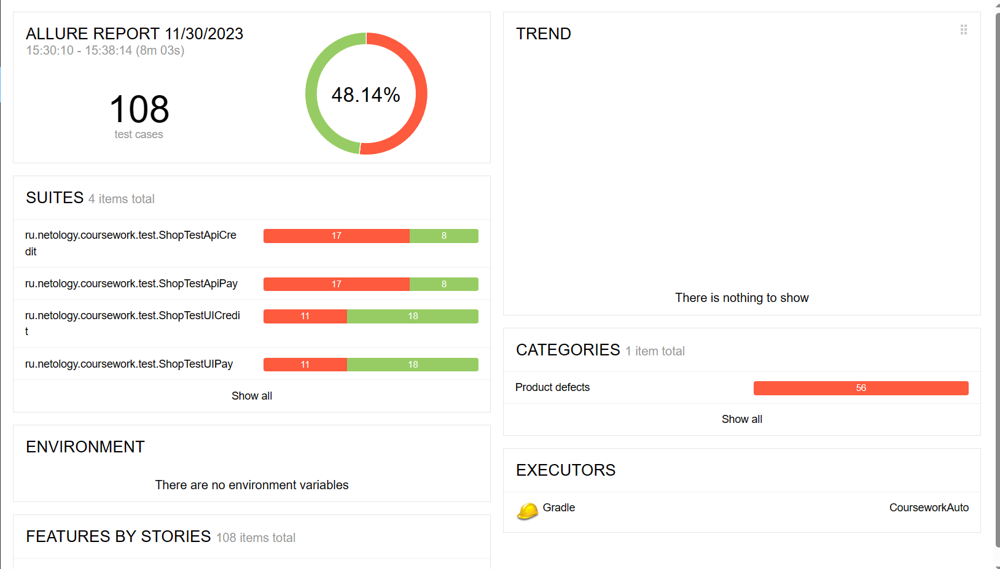

# Отчет о проведенном автоматизированном тестировании формы покупки тура

## Краткое описание
**Цель проекта:**
Автоматизировать позитивные и негативные сценарии покупки тура использованием языка программирования Java.
Автоматизировать API-тесты для приложения

**Основные функциональные требования:**
* Загружается главная страница приложения
* При нажатии кнопок "Купить" и "Купить в кредит" выходит форма олаты по карте или оформления кредита по данным карты
* Возможность ввода данных в форму оплаты или покупки в кредит тура  (номер карты, месяц и год срока карты, владельца карты и CVC/CVV код). 
* Проверка валидности введенных данных 
* Оформление заказа и отправка запроса
* Подтверждение успешного завершения покупки или Ошибка в случае отказа банка.
* Запрос в базу данных для получения информации по транзакции 

**Особенности реализации:**
* Использование языка Java для написания тестов и классов
* Использование Selenide для взаимодействия с веб-элементами и выполнения действий на странице приложения
* Использование JUnit5 для организации и запуска тестов
* Применение Gradle для управления зависимостями, сборки проекта и запуска тестов
* Применение Allure для построения отчетов по тестированию
* Применение библиотек rest-assured и gson для реализации API-тестов

**Отчетность:**
Отчеты о результатах тестирования генерируются с использованием возможностей JUnit5 и Allure и предоставляют подробную информацию о пройденных и проваленных тестах.

Данный проект автоматизирует ключевые сценарии тестирования веб-приложения и API, что позволит повысить эффективность и качество разработки, уменьшить время на прохождение данных сценариев в дальнейшем.

## Количество тест-кейсов(процент успешных и не успешных тест-кейсов)
Для каждой из форм оплаты тура ("Оплата по карте" и "Кредит по данным карты")  написано по 28 автотестов. Также для каждого пути при тестировании API ("/api/v1/pay" и "/api/v1/credit") было прописано по 25 автотестов. Прописаны проверки для каждого поля  (позитивные сценарии и негативные сценарии). Итого 108 тестов

 Тесты содержат проверки полей на валидность и запрос в базу данных для получения статуса транзакции. 
 Прописаны 4 тестовых класса. 2 для тестирования веб-интерфейса (по одному для каждой формы) и 2 для тестирования API (по одному для каждой формы).

Процент успешных тестов -  48,14 % (52 теста)
Процент не успешных тестов - 51,86 % (56 тестов)

## Общие рекомендации
Для поддержания тестов:
* Регулярно обновлять авто-тесты после с изменений в коде или функциональности, чтобы они оставались актуальными. 
* Поддерживать актуальность тестов, чтобы они оставались надежными и информативными.
* Использовать параметризацию для управления различными вариантами ввода данных в авто-тесты, чтобы они были более гибкими
* Регулярно добавлять новые авто-тесты для покрытия дополнительных сценариев использования и обеспечения полноты тестирования
* Поддерживать регулярную генерацию отчетов о результатах тестирования и метрик охвата тестами

Для приложения:
* Исправить баги в issue
* Сделать для кнопок "Купить" и "Купить в кредит" изменение цвета при нажатии
* Кнопку "Продолжить" сделать неактивной до заполнения всех полей валидными данными
